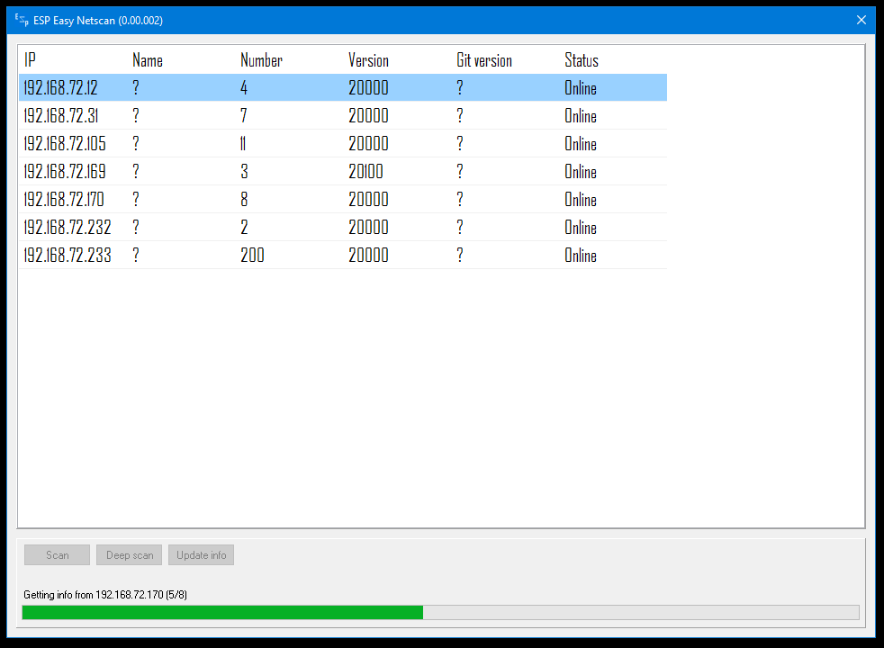

ESP Easy Netscan
------------



INTRO
------------
**ESP Easy Netscan** is a tool to scan your local LAN for ESP Easy units. If you are like me and want a overview of your network you will like this app. 

FEATURES
------------
```diff
+ Scan your (sub)network for ESP units. If they are found you can then fetch information about them.
+ Double click on a row and you are able to quickly open the web GUI of that particular unit.
+ From menu: ping that unit.
+ From menu: download the config file from that unit. It will be stored in the same folder path as the exe file.
+ Get which AP the unit is connected to, name it yourself using the AP.ini (found in Settings folder).
```

EXTRA INFORMATION
------------
* **ONLY WINDOWS** is supported (Windows 10, Windows 8.1, Windows 8, Windows 7) 

LEGEND
------------
```diff
+ Green is a feature already implemented
- Red is on the todo-list
```
