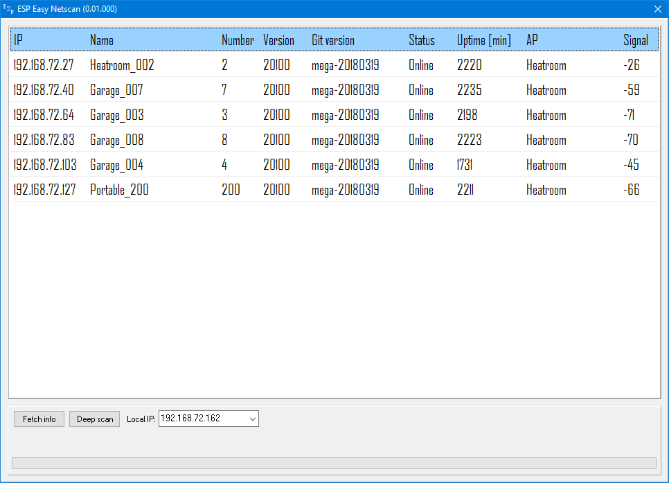

ESP Easy Netscan
------------



INTRO
------------
**ESP Easy Netscan** is a tool to scan your local LAN for ESP Easy units.

FEATURES
------------
```diff
+ ...
+ ...
```

EXTRA INFORMATION
------------
* **ONLY WINDOWS** is supported (Windows 10, Windows 8.1, Windows 8, Windows 7) 

LEGEND
------------
```diff
+ Green is a feature already implemented
- Red is on the todo-list
```
